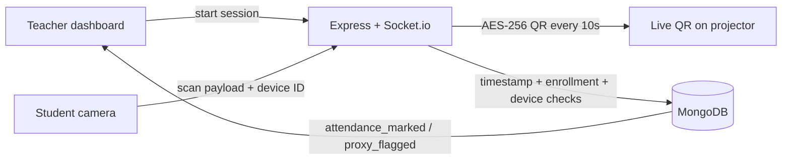
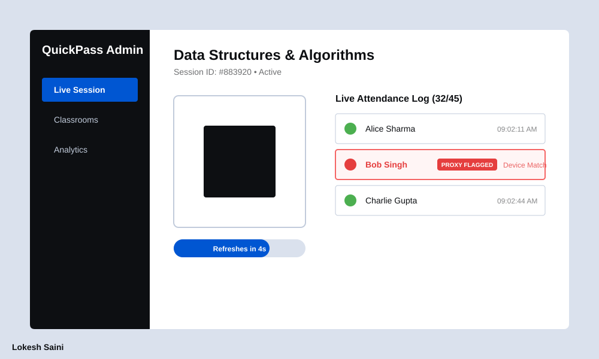
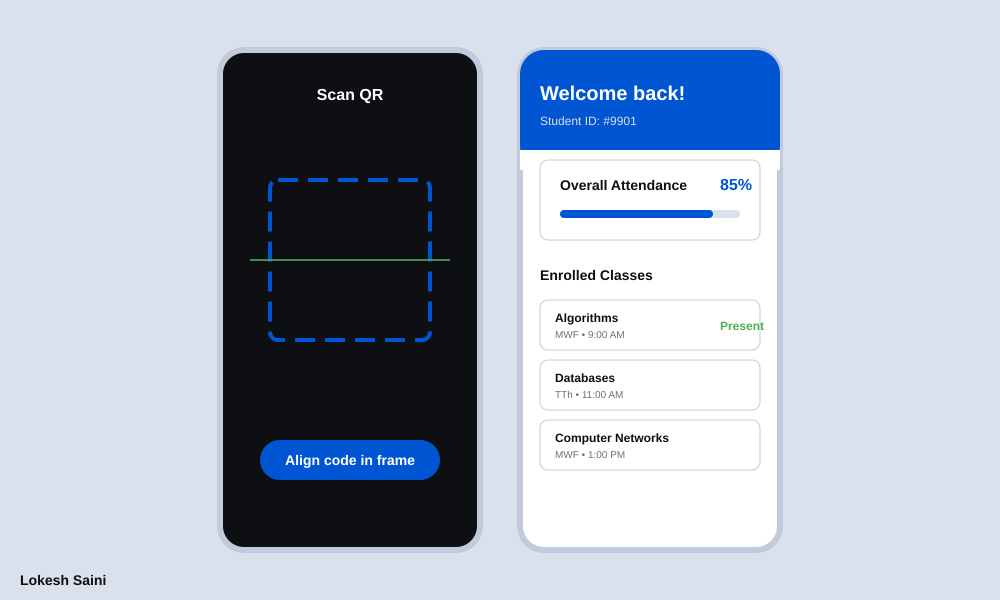

<div align="center">
  
</div>

<h1 align="center">QuickPass</h1>

<p align="center"><b>Cryptographically rotating QR attendance that kills screenshot proxies.</b></p>

<p align="center">
  Teachers project a live QR that expires every 10 seconds.<br />
  Students scan once from their own device. Duplicate devices get flagged in real time.
</p>

<div align="center">
  <h3>🚀 Live Demo</h3>
  <p><b>Frontend (Vercel):</b> <a href="https://quick-pass-client-bl4w.vercel.app/">https://quick-pass-client-bl4w.vercel.app/</a></p>
  <p><b>Backend API (Render):</b> <a href="https://quickpass-backend-cv0o.onrender.com">https://quickpass-backend-cv0o.onrender.com</a></p>
  <p><b>API Health Endpoint:</b> <a href="https://quickpass-backend-cv0o.onrender.com/health">https://quickpass-backend-cv0o.onrender.com/health</a></p>
</div>

<div align="center">

[](https://react.dev)
[](https://nodejs.org)
[](https://www.mongodb.com)
[](https://socket.io)
[](#)

</div>

---

## TL;DR for judges

| | |
| :--- | :--- |
| **Problem** | Static QR / roll call is slow and easy to proxy (screenshot + share). |
| **Fix** | AES-256 QR payload, **10s expiry**, **device binding**, live teacher feed. |
| **Run** | Live at [https://quick-pass-client-bl4w.vercel.app/](https://quick-pass-client-bl4w.vercel.app/) or locally via `npm run dev:client` |
| **Demo logins** | Teacher `teacher@quickpass.dev` · Student `alex@student.dev` · password `password123` |

**2-minute demo:** start a session as teacher → scan QR as student → attendance appears live → try the same phone as a second student → proxy alert.

Architecture, APIs, models, and security: **[Technical documentation](./TECHNICAL.md)**.

---

## Why this exists

Classroom attendance still fails in two ways: it **steals lecture time**, and it is **trivial to fake**. A screenshot of a static QR, or one phone passed around the room, is enough.

QuickPass treats attendance as a **short-lived cryptographic token**, not a picture:

1. Server encrypts `{ sessionId, teacherId, timestamp }` with **AES-256-CBC**.
2. Socket.io pushes a new payload to the teacher display **every 10 seconds**.
3. Scan after 10s is rejected as expired (replay / screenshot fails).
4. Each mark is bound to a **browser device ID**. Same device, different student → both flagged, teacher gets a live `proxy_flagged` event.

---

## How it works



**Server checks on every scan**

1. Decrypt payload — invalid cipher text rejected  
2. Timestamp age ≤ 10 seconds  
3. Session is `active`  
4. Student is enrolled in that classroom  
5. Not already marked present  
6. `deviceId` not already used by another student this session  

---

## Features

### Teacher

<div align="center">
  
</div>

- Start / end live sessions; QR auto-refreshes every 10s
- Live roster via WebSockets as students scan
- Instant **proxy alerts** when one device is reused
- Classroom CRUD, schedule, enroll by email or student ID
- Per-class analytics (attendance %, proxy counts)
- One-click **low-attendance emails** (&lt; 75%) when SMTP is configured

### Student

<div align="center">
  
</div>

- In-app camera scanner (no third-party QR app)
- **5-minute undo** for accidental scans
- Attendance history + course percentages
- Markdown notes per classroom
- Personal schedule view

---

## Judge walkthrough

Use two browsers (or one normal + one incognito) so teacher and student stay logged in.

| Step | Who | What to do |
| :---: | :--- | :--- |
| 1 | Teacher | Log in → **Sessions** → start session for **CS101** → leave the QR on screen |
| 2 | Student | Log in as Alex → **Scan** → point camera at the live QR |
| 3 | Teacher | Watch the roster update without refresh |
| 4 | Student | Optional: **Undo** within 5 minutes |
| 5 | Proxy test | Stay on the same browser, log in as Priya, scan the same QR → **proxy flag** on teacher UI |
| 6 | Teacher | **Analytics** for historical %, flags, and notify-at-risk (email optional) |

Seeded classroom: **Introduction to Computer Science (CS101)** — 1 teacher, 5 students, 2 past sessions.

---

## Demo accounts

Password for all seeded users: **`password123`**

| Role | Email | Notes |
| :--- | :--- | :--- |
| Teacher | `teacher@quickpass.dev` | Dr. Sarah Mitchell |
| Student | `alex@student.dev` | STU001 — has a sample note |
| Student | `priya@student.dev` | STU002 |
| Student | `carlos@student.dev` | STU003 |
| Student | `emma@student.dev` | STU004 |
| Student | `david@student.dev` | STU005 |

---

## Run locally

**Need:** Node.js 18+, MongoDB running locally (or Atlas URI).

```bash
# 1. Install
npm run install:all

# 2. Env (AES key must be exactly 32 characters)
cp server/.env.example server/.env

# 3. Seed demo users + CS101
npm run seed

# 4. Two terminals
npm run dev:server    # http://localhost:5000
npm run dev:client    # http://localhost:5173
```

Open **http://localhost:5173**. Vite proxies `/api` and `/socket.io` to port 5000.

### Environment (server)

| Variable | Required | Purpose |
| :--- | :---: | :--- |
| `MONGO_URI` | yes | Mongo connection |
| `JWT_SECRET` | yes | Auth tokens |
| `AES_ENCRYPTION_KEY` | yes | Exactly **32 chars** (AES-256) |
| `PORT` | no | Default `5000` |
| `CLIENT_URL` | no | CORS / Socket origin, default `http://localhost:5173` |
| `EMAIL_*` | no | Low-attendance mail; skipped if unset |

---

## Tech stack

| Layer | Stack |
| :--- | :--- |
| Client | React 19, Vite, Tailwind CSS, Socket.io-client, html5-qrcode, react-markdown |
| Server | Node, Express, Socket.io, Mongoose, JWT, bcrypt, Nodemailer |
| Data | MongoDB — Users, Classrooms, Sessions, AttendanceLogs, Notes |
| Security | AES-256-CBC QR payloads, JWT on HTTP + sockets, device ID anti-proxy |

```
quickpass/
├── client/          React app (port 5173)
├── server/          API + Socket.io QR engine (port 5000)
└── assets/          README screenshots
```

---

<div align="center">
  <i>Prasunethon 2.0 · built by Lokesh Saini</i>
</div>
