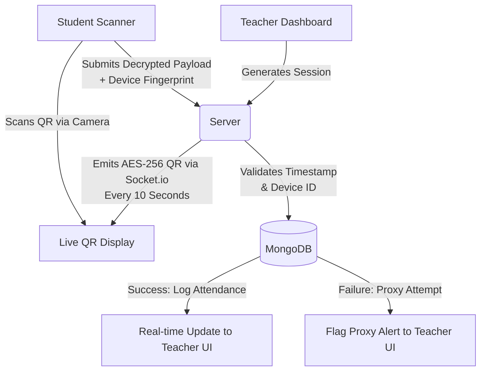

<div align="center">
  
</div>

<div align="center">
  
  
  
  
  
  
  <br />
  
  
</div>

<h1 align="center">QuickPass: Dynamic QR Ecosystem</h1>

<br />

## 🛑 The Problem vs. 💡 The Solution

| **The Problem: Proxy Fraud & Data Silos** | **The Solution: QuickPass** |
| :--- | :--- |
| Traditional attendance (roll calls, static QR codes, or Bluetooth beacons) is slow, easily spoofed (screenshot sharing), and lacks real-time verification. Students mark proxies from dorms, and educators waste class time managing records. | QuickPass uses **10-second AES-256 encrypted QR codes** synced via **WebSockets**. Each code expires instantly, destroying screenshot viability. Combined with **browser fingerprinting**, it guarantees *one physical device = one attendance mark*. |

## 🏗️ High-Level Architecture Flow



## ✨ Features

### 👨‍🏫 For Educators
*   **Live QR Sessions:** 10-second auto-refreshing cryptographic QR codes.
*   **Real-time Dashboard:** Watch attendance populate live via WebSockets.
*   **Anti-Proxy Alerts:** Instantly flags students attempting to scan from unrecognized/duplicate devices.
*   **Classroom Management:** Schedule builder and automated student enrollment.
*   **Analytics & Automation:** One-click low-attendance email warnings to at-risk students.

### 👨‍🎓 For Students
*   **Smart Built-in Scanner:** Camera interface that automatically handles the AES payload.
*   **Grace Period:** 5-minute undo window to correct mistaken scans.
*   **Personal Analytics:** Track attendance percentages across all enrolled courses.
*   **Integrated Notes:** Markdown-powered notebook tied directly to specific classrooms.

## 🚀 Local Setup Instructions

Follow these exact steps to run the full monorepo locally:

### 1. Install Dependencies
```bash
cd server && npm install
cd ../client && npm install
```

### 2. Configure Environment
```bash
cp server/.env.example server/.env
# Note: The .env is pre-filled with local hackathon credentials.
# Make sure MONGO_URI, JWT_SECRET, and AES_ENCRYPTION_KEY are set.
```

### 3. Seed Demo Data
Populate the database with a test teacher, students, and classroom:
```bash
cd server && npm run seed
```

### 4. Boot Up Application
Start both the backend and frontend servers concurrently (in two separate terminals):

**Terminal 1 (Backend):**
```bash
cd server && npm run dev
```

**Terminal 2 (Frontend):**
```bash
cd client && npm run dev
```

The application will be live at: **http://localhost:5173**

---
<div align="center">
  <p><i>Built for <b>Prasunethon 2.0</b> by <b>Lokesh Saini</b></i></p>
</div>
