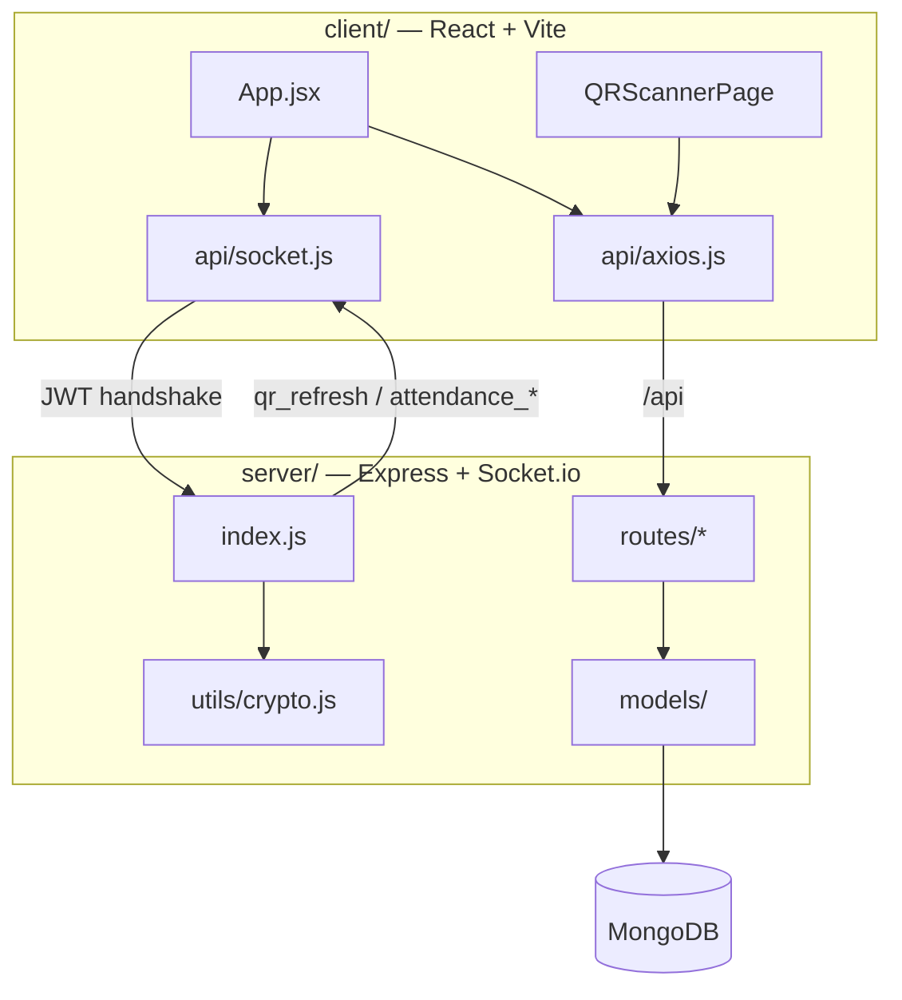
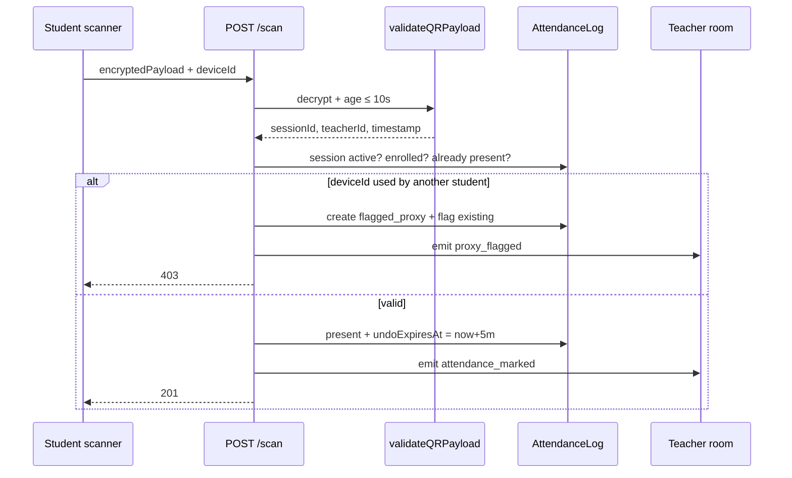
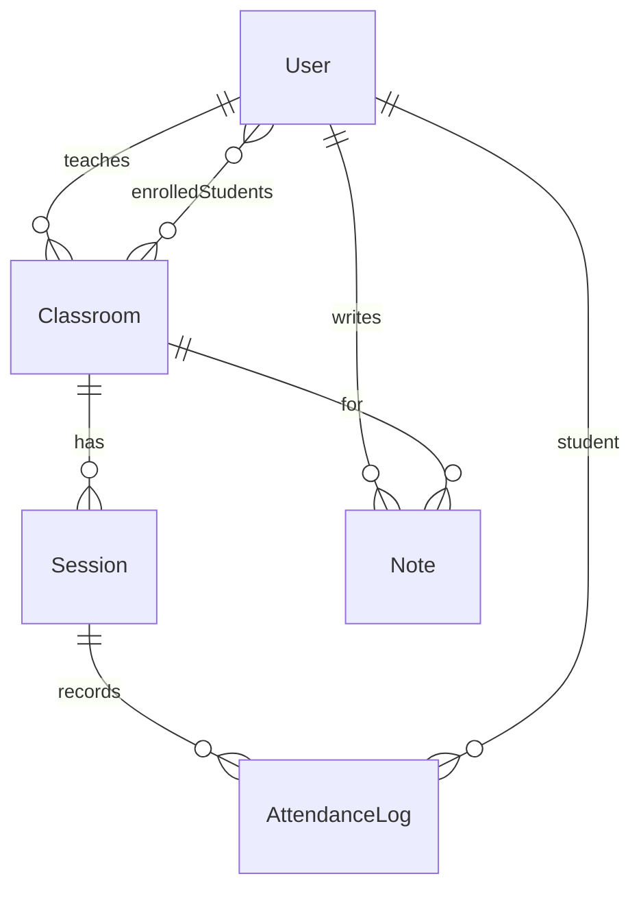

# QuickPass — Technical Documentation

**Hackathon:** Prasunethon 2.0  
**Product:** Cryptographically rotating QR attendance with device-bound anti-proxy  
**Repo layout:** npm workspaces (`client/` + `server/`)

This document is the engineering companion to [`README.md`](./README.md). Use the README to run and demo; use this file to judge architecture, APIs, and security.

---

## Table of contents

1. [Overview](#1-overview)
2. [Getting started](#2-getting-started)
3. [System architecture](#3-system-architecture)
4. [Backend](#4-backend)
5. [Frontend](#5-frontend)
6. [Core security mechanisms](#6-core-security-mechanisms)
7. [Infrastructure and tooling](#7-infrastructure-and-tooling)
8. [Glossary](#8-glossary)

---

## 1. Overview

QuickPass is a real-time attendance platform. It treats a scan as a **short-lived cryptographic token**, not a static image. That design targets two failure modes of classroom attendance: **time wasted on roll call** and **proxy fraud** (screenshot sharing or one phone passed around).

### Security pillars

| Pillar | What happens | Where |
| :--- | :--- | :--- |
| **Dynamic payload** | `{ sessionId, teacherId, timestamp }` is AES-256-CBC encrypted and rotated every 10s | `server/utils/crypto.js`, `server/index.js` |
| **Expiry** | `validateQRPayload` rejects tokens older than 10,000 ms | `server/utils/crypto.js` |
| **Device binding** | Scan body includes a browser `deviceId`; reuse by another student flags both | `client/src/utils/helpers.js`, `server/routes/student.js` |

### Scan validation pipeline

On `POST /api/student/scan` the server:

1. Decrypts the AES payload (tampered IV/ciphertext fails).
2. Rejects if timestamp age is outside `[0, 10s]`.
3. Confirms the `Session` is `active`.
4. Confirms the student is in `Classroom.enrolledStudents`.
5. Rejects if already `present` for that session.
6. If `deviceId` already marked **another** student present → both logs become `flagged_proxy` and the teacher room receives `proxy_flagged`.

### Communication channels

| Channel | Stack | Used for |
| :--- | :--- | :--- |
| REST | Express + Axios | Auth, classroom CRUD, notes, analytics, scan submit |
| WebSocket | Socket.io | `qr_refresh`, live roster, proxy alerts |
| SMTP | Nodemailer | Optional emails when attendance &lt; 75% |

---

## 2. Getting started

**Prerequisites:** Node.js 18+, MongoDB (local or Atlas).

```bash
npm run install:all
cp server/.env.example server/.env   # AES_ENCRYPTION_KEY must be exactly 32 characters
npm run seed
npm run dev:server                   # http://localhost:5000
npm run dev:client                   # http://localhost:5173
```

Vite proxies `/api` and `/socket.io` to port 5000 (`client/vite.config.js`).

### Environment

| Variable | Required | Notes |
| :--- | :---: | :--- |
| `MONGO_URI` | yes | Default example: `mongodb://localhost:27017/quickpass` |
| `JWT_SECRET` | yes | Signs 7-day JWTs (`id`, `role`) |
| `AES_ENCRYPTION_KEY` | yes | **Exactly 32 chars** or the process exits |
| `PORT` | no | Default `5000` |
| `CLIENT_URL` | no | CORS + Socket origin; default `http://localhost:5173` |
| `EMAIL_HOST`, `EMAIL_USER`, `EMAIL_PASS`, `EMAIL_PORT`, `EMAIL_FROM` | no | Low-attendance mail; skipped if incomplete |

Startup in `server/index.js` refuses to boot if `MONGO_URI`, `JWT_SECRET`, or `AES_ENCRYPTION_KEY` are missing.

### Seed data (`server/seed.js`)

Wipes `User`, `Classroom`, `Session`, `AttendanceLog`, `Note`, then creates:

- Teacher **Dr. Sarah Mitchell** — `teacher@quickpass.dev`
- Five students STU001–STU005 (Alex, Priya, Carlos, Emma, David)
- Classroom **CS101** (Mon/Wed 09:00–10:30, Fri 11:00–12:30), all five enrolled
- Two **completed** sessions with historical logs (4/5 then 5/5 present)
- One markdown note for Alex

Password for all seeded users: `password123`.

---

## 3. System architecture

```
quickpass/
├── package.json          # workspaces: client, server
├── client/               # React 19 + Vite (5173)
│   └── src/
│       ├── App.jsx
│       ├── api/axios.js
│       ├── api/socket.js
│       ├── context/AuthContext.jsx
│       └── pages/        # landing, auth, teacher/*, student/*
└── server/               # Express + Socket.io (5000)
    ├── index.js          # HTTP + QR interval engine
    ├── routes/           # auth, teacher, student
    ├── models/           # User, Classroom, Session, AttendanceLog, Note
    ├── middleware/       # protect, authorize, errorHandler
    └── utils/            # jwt, crypto, email
```



### Request lifecycle

1. **REST (state changes):** login issues JWT → Axios attaches `Authorization: Bearer` → `protect` + `authorize(role)` → route handler → MongoDB.
2. **WebSocket (session heartbeat):** teacher emits `join_session` → server starts `setInterval(10s)` if needed → `qr_refresh` to room `session_{sessionId}`. Successful scans emit `attendance_marked`; conflicts emit `proxy_flagged`.
3. **SMTP (async):** `POST /api/teacher/classrooms/:id/notify-low-attendance` emails enrolled students under 75%.

### Entity map

| Domain language | Code |
| :--- | :--- |
| Course / class | `Classroom` |
| Live attendance window | `Session` (`active` \| `completed`) |
| One student mark | `AttendanceLog` |
| Anti-fraud | `validateQRPayload` + `deviceId` uniqueness per session |

---

## 4. Backend

Entry: `server/index.js`. One `http.Server` hosts Express and Socket.io. `global.io` lets route handlers emit into session rooms.

**HTTP pipeline:** CORS → JSON body → `/health` → `/api/auth` · `/api/teacher` · `/api/student` → 404 → `errorHandler`.

### 4.1 API routes

All teacher/student routers apply `protect` then `authorize('teacher'|'student')`.

#### Auth — `server/routes/auth.js` (public)

| Method | Path | Body | Success |
| :--- | :--- | :--- | :--- |
| POST | `/api/auth/register` | `name`, `email`, `password`, `role`, optional `studentId` | `201` `{ token, user }` |
| POST | `/api/auth/login` | `email`, `password` | `200` `{ token, user }` |

Passwords hashed with bcrypt (cost 10). Duplicate email → `409`. Bad credentials → `401`. JWT payload: `{ id, role }`, expiry **7 days**. `User.toJSON()` strips `password`.

#### Teacher — `server/routes/teacher.js`

| Method | Path | Purpose |
| :--- | :--- | :--- |
| GET | `/api/teacher/classrooms` | List classrooms for logged-in teacher |
| POST | `/api/teacher/classrooms` | Create (`name`, `courseCode`, optional `schedule`) |
| PUT | `/api/teacher/classrooms/:id` | Update |
| DELETE | `/api/teacher/classrooms/:id` | Delete |
| POST | `/api/teacher/classrooms/:id/enroll` | Enroll by `email` or `studentId` (`$addToSet`) |
| DELETE | `/api/teacher/classrooms/:id/enroll/:studentId` | Unenroll |
| GET | `/api/teacher/classrooms/:id/sessions` | Session history |
| POST | `/api/teacher/classrooms/:id/sessions/start` | Close other active sessions, create `active` |
| POST | `/api/teacher/sessions/:sessionId/end` | Set `completed` + `endTime` |
| GET | `/api/teacher/sessions/:sessionId/attendance` | Logs for live roster |
| GET | `/api/teacher/classrooms/:id/analytics` | Per-student %, `proxyCount`, `proxyFlags` |
| POST | `/api/teacher/classrooms/:id/notify-low-attendance` | Email students &lt; 75% |
| GET | `/api/teacher/sessions/:sessionId/qr` | REST fallback: one encrypted payload, `expiresIn: 10` |

#### Student — `server/routes/student.js`

| Method | Path | Purpose |
| :--- | :--- | :--- |
| POST | `/api/student/scan` | Decrypt QR + anti-proxy + mark present |
| POST | `/api/student/undo/:logId` | Cancel if within 5 minutes (`undoExpiresAt`) |
| GET | `/api/student/my-classrooms` | Enrolled classes |
| GET | `/api/student/my-attendance` | Per-class stats + logs |
| GET | `/api/student/active-sessions` | Active sessions for enrolled classes |
| GET | `/api/student/schedule` | Classes + weekly schedule |
| GET/POST | `/api/student/notes/:classroomId` | List / create notes |
| PUT/DELETE | `/api/student/notes/:noteId` | Update / delete own notes |

**Scan sequence**



### 4.2 Security layer

| Mechanism | Implementation |
| :--- | :--- |
| Boot guard | Required env vars; AES key length === 32 |
| JWT HTTP | `Authorization: Bearer` via `protect` |
| RBAC | `authorize('teacher')` / `authorize('student')` |
| JWT sockets | Handshake `auth.token` verified in `io.use` |
| Passwords | bcryptjs |
| QR secrecy + freshness | AES-256-CBC + 10s window |
| Errors | `errorHandler`: 11000 → 409, ValidationError → 400, JWT errors → 401 |

### 4.3 Real-time QR engine

`activeQRIntervals: Map<sessionId, intervalId>` in `server/index.js`.

| Socket event | Direction | Role | Effect |
| :--- | :--- | :--- | :--- |
| `join_session` | client → server | teacher | Join `session_{id}`; start 10s QR loop if missing |
| `leave_session` | client → server | teacher | Leave room; clear interval if room empty |
| `join_session_as_student` | client → server | student | Join same room for live updates |
| `qr_refresh` | server → room | — | `{ payload, timestamp }` |
| `attendance_marked` | server → room | — | Populated log |
| `proxy_flagged` | server → room | — | Conflicting student IDs + deviceId |
| `attendance_cancelled` | server → room | — | After undo |

`sendQR()` runs immediately, then every 10,000 ms. Payload from `generateQRPayload(sessionId, teacherId)`.

### 4.4 Data models



**User** — `name`, unique `email`, `password`, `role` ∈ {teacher, student}, optional `studentId`.

**Classroom** — `teacherId`, `name`, `courseCode` (uppercase), `schedule[]` `{ day, startTime, endTime }`, `enrolledStudents[]`.

**Session** — `classroomId`, `date`, `startTime`, `endTime`, `status` ∈ {active, completed}.

**AttendanceLog** — `sessionId`, `studentId`, `deviceId`, `timestamp`, `status` ∈ {present, flagged_proxy, cancelled}, `undoExpiresAt`, `proxyFlag` `{ suspectedDeviceId, suspectedStudentId }`. Unique index `(sessionId, studentId)`.

**Note** — `studentId`, `classroomId`, `title`, `content` (markdown).

---

## 5. Frontend

SPA: React 19, React Router 7, Tailwind 3, Context API (no Redux). Design tokens live in `client/tailwind.config.js` (primary `#0d0f12`, accent `#0056d2`, background `#dae1ed`, Source Sans Pro).

### 5.1 Routing and auth

`AuthProvider` hydrates `qp_token` / `qp_user` from `localStorage`. Login/register persist them and call `initSocket(token)`. Logout clears storage and disconnects the socket.

`ProtectedRoute` sends unauthenticated users to `/login` and wrong-role users to their own dashboard. `AuthGuard` on `/login` and `/register` redirects if already signed in.

| Path | Access |
| :--- | :--- |
| `/`, `/login`, `/register` | Public |
| `/dashboard/teacher`, `.../classrooms`, `.../sessions`, `.../analytics` | Teacher |
| `/dashboard/student`, `.../scan`, `.../attendance`, `.../notes`, `.../schedule` | Student |
| `/teacher/*`, `/student/*` | Redirect to `/dashboard/...` |

### 5.2 API and socket clients

- `axios.js`: `baseURL: '/api'`, request interceptor adds JWT; **401** clears storage and sends the browser to `/`.
- `socket.js`: singleton `io('/', { auth: { token } })`, websocket + polling, 5 reconnect attempts.

### 5.3 Teacher dashboard

Layout: `TeacherLayout.jsx` (Overview, Classrooms, Sessions, Analytics).

**Sessions** is the live loop: start session → `initSocket` → `join_session` → render QR from `qr_refresh` (`qrcode` lib) → listen for `attendance_marked` / `proxy_flagged`.

**Analytics** consumes classroom aggregates and can trigger notify-low-attendance.

### 5.4 Student dashboard

Layout: `StudentLayout.jsx` (Overview, Scan QR, My Attendance, Notes, Schedule).

**Scan:** `html5-qrcode` camera → `getDeviceId()` → `POST /scan`. On success, 5-minute undo countdown; `POST /undo/:logId` sets status `cancelled`.

**Notes:** markdown stored per classroom (`react-markdown` / `marked`).

### 5.5 Public pages

`LandingPage.jsx` — product pitch and CTAs. `LoginPage` / `RegisterPage` — role-aware forms posting to `/api/auth/*`.

---

## 6. Core security mechanisms

### 6.1 QR payload cryptography

`server/utils/crypto.js`

- Algorithm: **AES-256-CBC**, IV 16 random bytes.
- Wire format: `ivHex:ciphertextHex`.
- Plaintext JSON: `{ sessionId, teacherId, timestamp: Date.now() }`.
- `validateQRPayload`: decrypt → parse → require fields → reject if `age > 10_000` or `age < 0`.

Students never decrypt in the browser. The camera reads the ciphertext; the **server** decrypts with the shared key. Screenshots die because the timestamp is stale before they can be reused.

REST fallback: `GET /api/teacher/sessions/:sessionId/qr` for a single payload if sockets fail.

### 6.2 Anti-proxy detection

`getDeviceId()` (`client/src/utils/helpers.js`):

1. Return `localStorage.qp_device_id` if set.
2. Else hash `userAgent | language | colorDepth | width | height | timezoneOffset | hardwareConcurrency | platform`.
3. Append a random suffix; persist.

Same physical browser stays stable. Incognito / another browser = new ID (proxy demo: same profile, two student logins).

On conflict the API:

- Creates a `flagged_proxy` log for the new student (with `proxyFlag`).
- Updates the original log to `flagged_proxy`.
- Emits `proxy_flagged` to the teacher room.
- Returns **403**.

---

## 7. Infrastructure and tooling

| Concern | Choice |
| :--- | :--- |
| Package graph | Root npm workspaces |
| Scripts | `install:all`, `seed`, `dev:server`, `dev:client` |
| Dev proxy | Vite → `localhost:5000` for `/api` and `/socket.io` |
| Client lint | `oxlint` (`client/package.json`) |
| Client build | `vite build` |
| Health | `GET /health` → `{ status, timestamp }` |
| Secrets | `.env` gitignored; `.env.example` committed |

Email is **best-effort**: missing SMTP logs a warning and `sendLowAttendanceEmail` returns `{ success: false }` instead of crashing.

---

## 8. Glossary

| Term | Meaning |
| :--- | :--- |
| **Dynamic QR** | Encrypted payload rotated every 10s; not a static image |
| **QR payload** | `iv:ciphertext` wrapping `{ sessionId, teacherId, timestamp }` |
| **Device ID** | Client fingerprint stored as `qp_device_id` |
| **Proxy flag** | Same `deviceId`, two `studentId`s in one session |
| **Undo period** | 5 minutes after a successful scan (`undoExpiresAt`) |
| **Low attendance** | Present count / session count &lt; 75% |
| **Socket room** | `session_{sessionId}` |
| **JWT** | 7-day token `{ id, role }` on HTTP and Socket handshake |

---

## Known limits (honest for judging)

- Device ID is a **browser persistent ID**, not hardware TPM attestation. Clearing site data or using a second browser produces a new ID.
- AES key is **server-side**; anyone who can scan still must be an enrolled, authenticated student with a fresh token.
- Clock skew: validation uses server `Date.now()` vs payload timestamp generated on the server, so client clock does not expire codes.
- SMTP is optional; analytics still work without it.

---

*Prasunethon 2.0 · QuickPass · Lokesh Saini*
